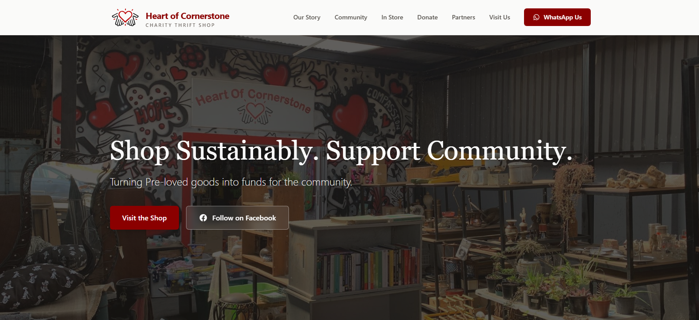

# 🧡 Heart of Cornerstone


A fully responsive marketing and informational website built pro bono for **Heart of Cornerstone**, a charity thrift shop in Johannesburg South. The site was designed to drive foot traffic, encourage donations, and showcase the shop's local community impact.

## 🌐 Live Site

**[cornerstonecharity.org.za](https://cornerstonecharity.org.za)**

---



## 📖 Overview

The shop needed a clean, trustworthy web presence that could do three things: get people through the door, get people donating, and connect people directly via WhatsApp and Facebook. There's no backend or admin dashboard — this is a fast, narrative-driven single-page site focused entirely on conversion and community trust.

The site walks visitors through:

- **In-Store Preview** — a glimpse of current stock to build excitement before a visit
- **Community Impact** — a portfolio of the charity's work (elderly care, animal welfare, and more) to build trust
- **Donations & Visit Info** — clear guidelines on accepted items, drop-off details, operating hours, and location
- **Direct Communication** — integrated WhatsApp buttons (including a daily-arrivals group) and a link to their active Facebook page

---

## 🛠️ What I Built

Built from a blank Vite/React scaffold — the entire application architecture, layout, and styling were built from scratch with Tailwind CSS.

- Complete narrative-driven single-page layout, broken into custom components: `Header` (with a mobile hamburger menu), `Hero`, `OurStory`, `Community`, `InStore`, `Donate`, `Visit`, `Partners`, and `Footer`
- **Custom `ImpactCard` component** — a reusable card featuring a `useState`-driven image slider that works across both mobile and desktop
- **Custom Partners marquee** — an infinite, CSS-animated scrolling strip of sponsor logos that pauses on hover
- Fully responsive design, built mobile-first

---

## 🧰 Tech Stack

- React (Vite)
- Tailwind CSS
- Deployed on Netlify

---

## 🚀 Getting Started

```bash
# Clone the repo
git clone https://github.com/Sangiwe/heart-of-cornerstone.git
cd heart-of-cornerstone

# Install dependencies
npm install

# Run the dev server
npm run dev
```

---


## 💡 About the Project

This was a focused, end-to-end frontend build — designed, built, and deployed solo for a real charity organisation over several weeks. It's a good example of taking a project from a blank scaffold to a live, production site for an actual client, with attention to custom interaction details rather than relying on a template.